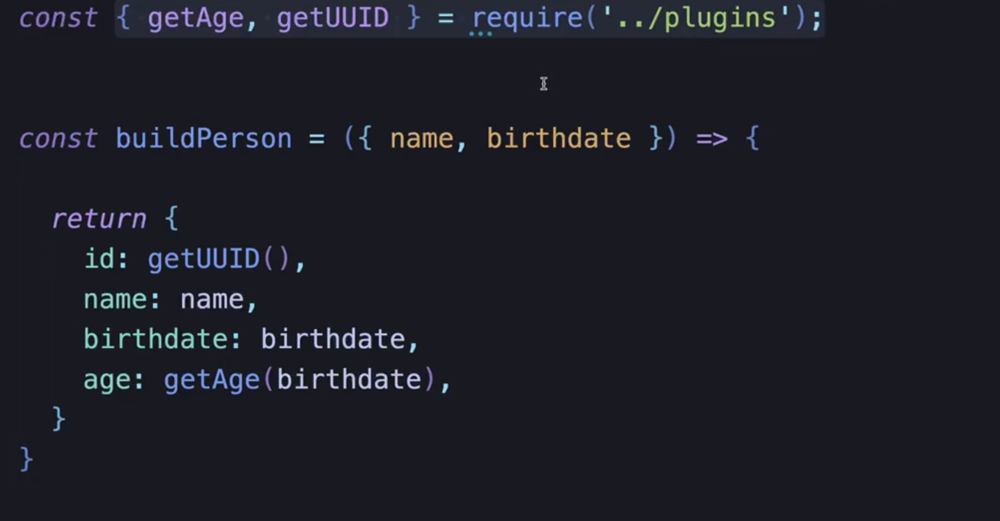
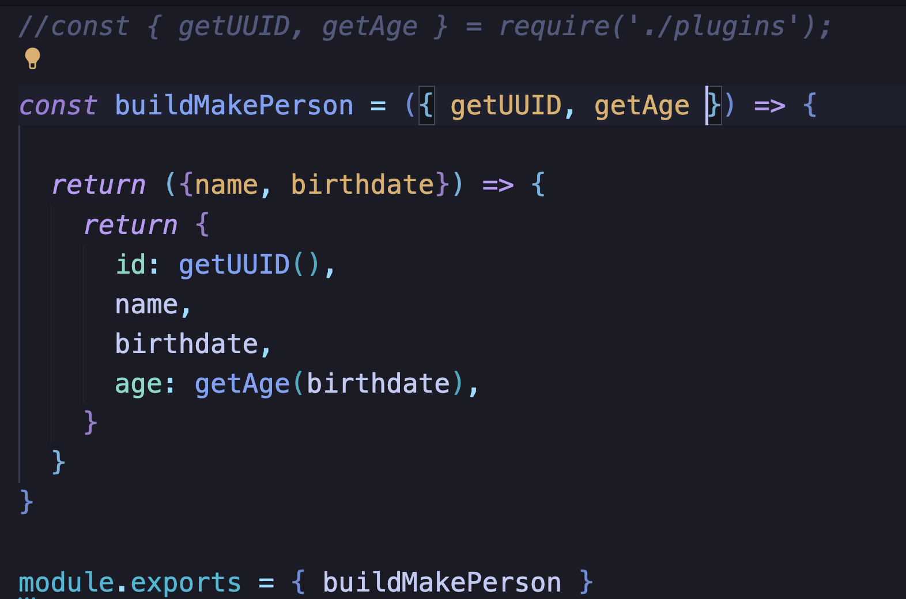

## Patron Adaptador y Factory Functions en Javascript

- JavaScript a pesar de ser débilmente tipado se puede aplicar patrones de arquitectura para asegurarnos que nuestra aplicación puede ser tolerante a cambios, fácil de expandir, de escalar, entre otras cosas. Y todo eso en Javascript va a partir sobre las Factory Functions.
- Factory Functions: no es más que una función que crea otra función
- Patrón adaptador: a la hora de trabajar con dependencias de terceros idealmente nosotros queremos crearnos algún tipo de capa o protección, que en realidad es nuestro propio código que adapta una dependencia de terceros para que nuestro código no dependa del código de terceros.
- Nuestras entidades no deberían tener dependencias de otros archivos o dependencias de terceros. Como es el caso del siguiente ejemplo: 
- Para evitar esa dependencia, convertiremos la función anterior a otra función que reciba como parámetros las dependencias, quedándonos así:

- Esto es un ejemplo de Factory Functions
